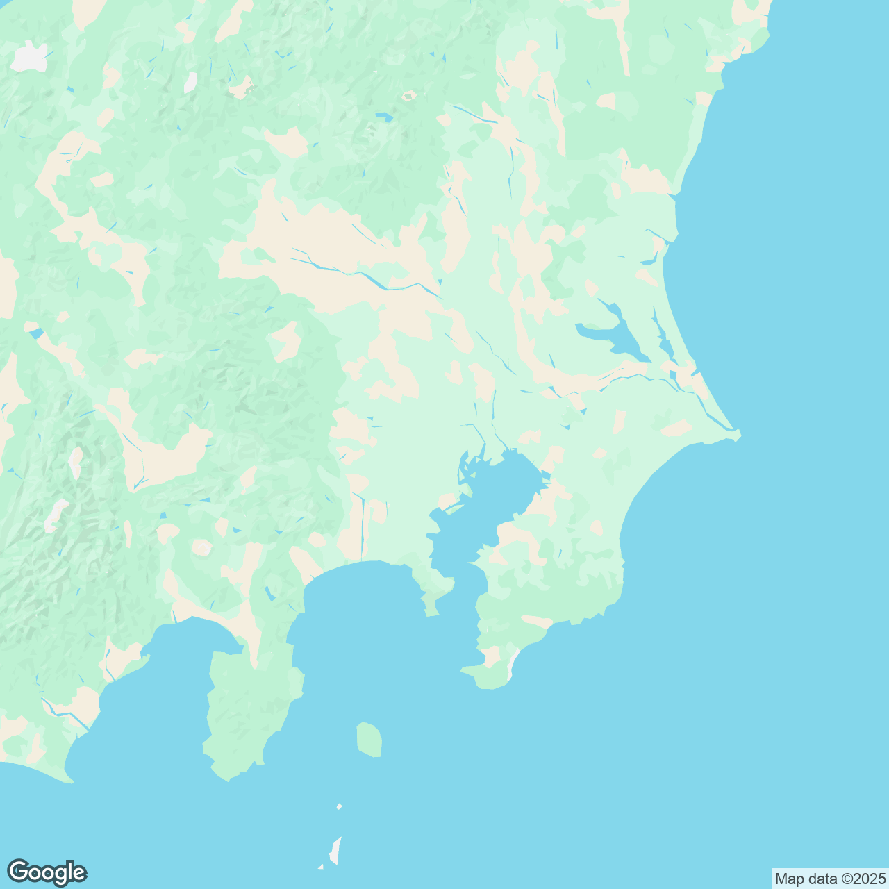

# Map Generator

[](https://github.com/super-linter/super-linter)

[](https://github.com/actions/typescript-action/actions/workflows/check-dist.yml)
[](https://github.com/actions/typescript-action/actions/workflows/codeql-analysis.yml)
[](./badges/coverage.svg)

This action generates a custom-styled static map image using the Google Maps
Static API and save it to repository as `.png`.



It supports:

- generating a map with best quality that the API allows
- Map style customization through `src/map-style.json`

> [!tip]
>
> Find more styles in [SNAZZY](https://snazzymaps.com/)

## Usage

### Prerequisite

1. Apply a
   [Google Maps Static API](https://developers.google.com/maps/documentation/maps-static)
   Key
1. Set it as an Action Secret named `MAP_API_KEY` in your GitHub repository's
   Settings > Secrets and variables > Actions

### Inputs

1. `google_static_map_api_key`
1. `address`: the detailed address of the map center; see
   [Google Maps Static API — Addresses](https://developers.google.com/maps/documentation/maps-static/start#Addresses)
   for validation guidance
1. `zoom`: The zoom level of the map. Typically ranges from 0 (world view) to
   20+ (building level).
1. `output`: output path and filename for the generated map image

### Usage Example

```yml
- name: Generate google static map
  uses: sn-f-qr/google-map-generator@v1
  with:
    google_static_map_api_key: ${{ secrets.MAP_API_KEY }}
    address: 'Shinjuku, Tokyo'
    zoom: '8'
    output: 'public/generated-map.png'
```

See actual
[usage](https://github.com/SN-F-QR/academic-personal/blob/main/.github/workflows/commit-snake.yml)
